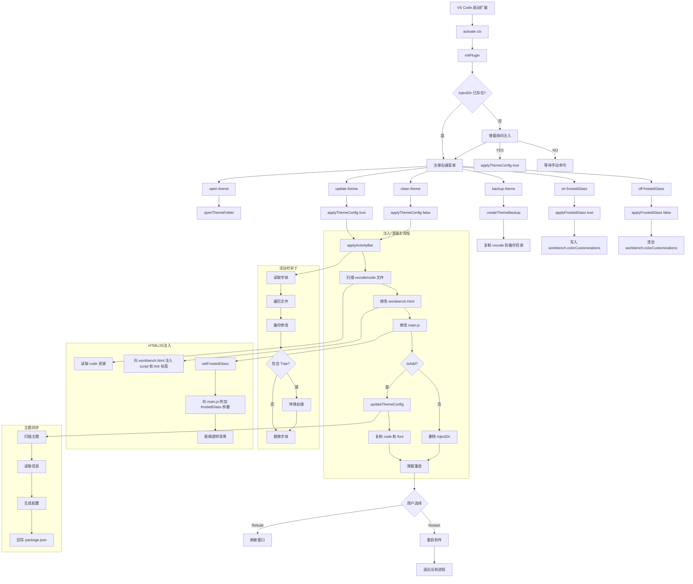

# 项目实现流程图

下面的流程图基于当前仓库实现整理，覆盖扩展启动、主题注入、清理、备份与毛玻璃开关几个主流程。

## 模块关系

- `src/extension.js`：扩展入口，负责初始化、注册命令、执行注入/清理/备份流程。
- `src/utils.js`：提供文件备份恢复、目录复制、配置读写、工作区添加、应用重启等通用能力。
- `src/theme.js`：扫描 `vscode/theme/*.json`，动态刷新 `package.json` 里的主题列表。
- `vscode/code/`：真正注入到宿主工作台里的 CSS/JS。
- `vscode/font/`：注入后的字体资源目录。
- `vscode/patch/activityBar.js`：Trae CN 宿主的活动栏补丁。
- `vscode/patch/frostedGlass.js`：毛玻璃配置和宿主 `main.js` 补丁逻辑。

## 关键实现特点

- 扩展不只是“切换主题”，还会直接修改宿主安装目录下的工作台文件。
- 每次写入前会先生成 `.bak` 备份，清理时再从备份恢复。
- 主题列表不是纯静态配置，而是由 `vscode/theme` 目录扫描后同步到 `package.json`。
- 菜单里的 `on/off frostedGlass` 只修改 VS Code 配色配置；宿主 `main.js` 的毛玻璃参数注入发生在 `applyThemeConfig` 阶段。
- 注入时会复制 `vscode/code` 和 `vscode/font`；清理时当前实现只删除 `injectDir`，不会额外删除 `injectFontDir`。
