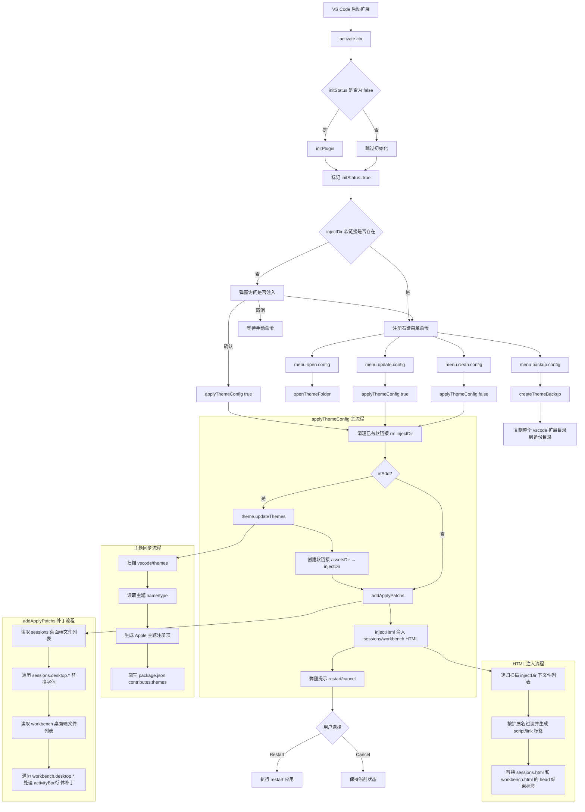

# 项目实现流程图

下面的流程图基于当前仓库实现整理，覆盖扩展启动、主题注入、清理、备份与毛玻璃开关几个主流程。

## 模块关系

几个目录和文件之间的关系大致如下：

- `src/extension.js` — 扩展入口，负责注册命令、初始化路径、编排注入与补丁流程
- `src/lib/utils.js` — 通用工具集：文件读写、备份、重启、配置读写、目录扫描等
- `src/lib/i18n.js` — 国际化模块：读取 `package.nls.json` / `package.nls.zh-cn.json` 并提供翻译函数
- `src/lib/patch.js` — 补丁执行入口：读取 `vscode/patches/activity-bar.js` 配置并执行 `traeActivityBar()` 补丁
- `src/lib/theme.js` — 主题构建：扫描 `vscode/themes/` 下的 JSON 文件，生成 `package.json` 中的 `contributes.themes`
- `vscode/assets/` — 运行时注入资源：`css/` 样式文件、`fonts/` 字体文件、`fixes.js` 浏览器端 UI 修复脚本、`utils.js` DOM 工具函数
- `vscode/patches/activity-bar.js` — 活动栏补丁配置（search/replace 规则和 CSS 样式字符串）
- `vscode/patches/refs/` — 源码参考与辅助工具：`sync.sh` 同步脚本、`sources/` 参考源码、`prompt/` 补丁提示词

## 关键实现特点

- **注入 ≠ 拷贝**：当前采用软链接（`utils.symlink`）方式注入资源，避免重复拷贝大量字体文件，清理时用 `utils.rm` 删除软链接
- **安全修改**：`safeModifyFile` 会在每次修改前自动创建 `.bak` 备份，清理时基于备份恢复原文件
- **双向平台支持**：兼容 VSCode 标准版和 Trae CN 宿主环境，通过 `app.name` 区分执行分支
- **自动语言切换**：根据 VS Code 当前显示语言自动加载 `package.nls.zh-cn.json` 或 `package.nls.json`，命令提示支持中/英文
- **主题自适应**：`src/lib/theme.js` 扫描所有主题 JSON，自动读取 `name` 和 `type` 字段，按 `Apple ${name}` 格式注册到 `package.json`
- **补丁可配置**：活动栏补丁的 search/replace 规则全部集中在 `vscode/patches/activity-bar.js`，支持按字符串精确匹配，不依赖正则
- **防重复初始化**：通过 `initStatus` 全局标志确保 `initPlugin` 只在首次激活时运行
