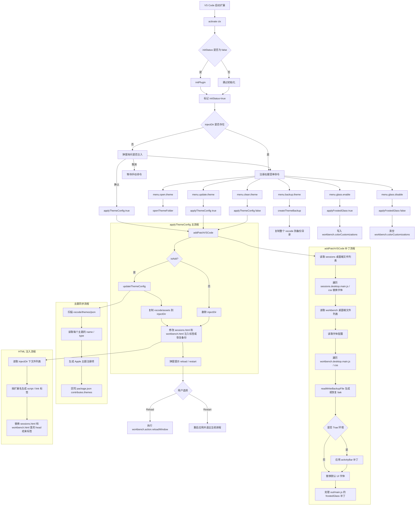

# 项目实现流程图

下面的流程图基于当前仓库实现整理，覆盖扩展启动、主题注入、清理、备份与毛玻璃开关几个主流程。

## 模块关系

- `src/extension.js`：扩展入口，负责初始化、注册命令、执行注入/清理/备份流程。
- `src/utils.js`：提供文件备份恢复、目录复制、配置读写、工作区添加、应用重启、语言检测等通用能力。
- `src/locales/il8n.js`：国际化模块，根据 VS Code 当前语言加载中文或英文文案，并提供 `translate()` 模板替换函数。
- `src/locales/i18n/`：存放 `zh.json` 和 `en.json` 双语文案文件。
- `vscode/assets/`：真正注入到宿主工作台里的 CSS、JS 和字体资源。
- `vscode/patchs/patch.js`：补丁执行入口，读取 `config/patchs.js` 中的规则并执行活动栏与毛玻璃文本替换。
- `vscode/patchs/config/patchs.js`：活动栏补丁规则与毛玻璃补丁规则配置。
- `vscode/patchs/config/window.js`：窗口玻璃效果参数与 `workbench.colorCustomizations` 配色配置。
- `vscode/themes/theme.js`：扫描 `vscode/themes/json/*.json`，动态刷新 `package.json` 里的主题列表。

## 关键实现特点

- 扩展不只是「切换主题」，还会直接修改宿主安装目录下的工作台文件。
- 每次写入前会先生成 `.bak` 备份，清理时再从备份恢复。
- 主题列表不是纯静态配置，而是由 `vscode/themes/json` 目录扫描后通过 `vscode/themes/theme.js` 同步到 `package.json`。
- 菜单里的 `glass enable/disable` 只修改 VS Code 配色配置；宿主 `main.js` 的毛玻璃参数注入发生在 `addPatchVSCode` 阶段。
- 当前 `glass enable/disable` 的实现会直接写入 `workbench.colorCustomizations`，不会合并已有的用户自定义颜色配置。
- 注入时会复制整个 `vscode/assets` 到宿主工作台的 `injectDir`；清理时会直接删除该注入目录。
- 字体补丁分两个阶段：先在 `sessions.desktop.*` 文件中替换默认字体为自定义字体，再在 `workbench.desktop.*` 文件中同样处理。
- `sessions.html` 额外注入 `fonts.css` 引用，`workbench.html` 注入 `assets/` 下的 CSS 和 JS 文件，两者使用不同的注入标签集合。
